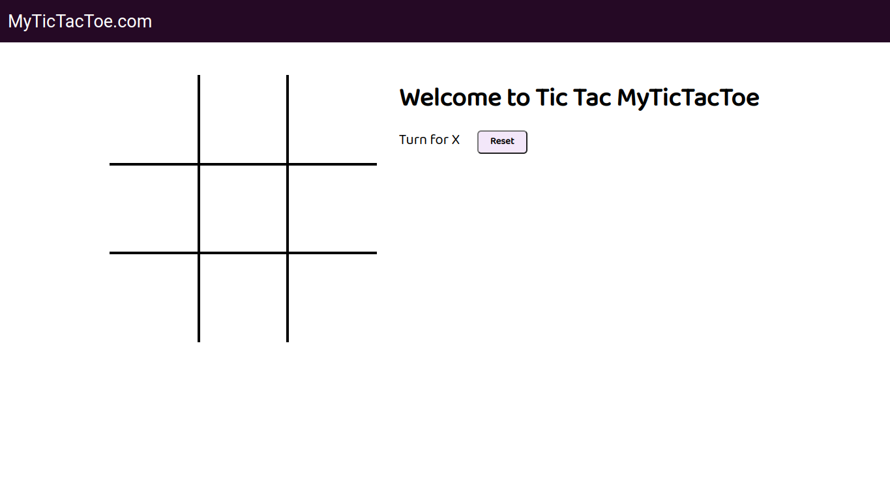
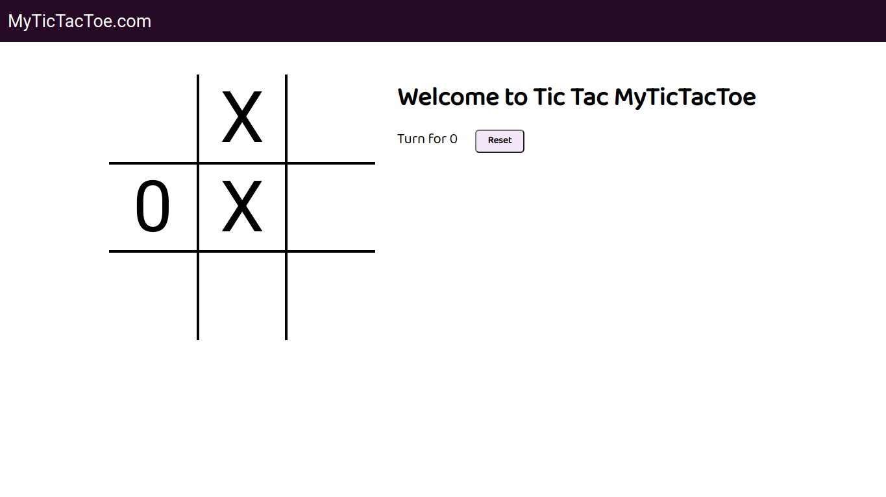
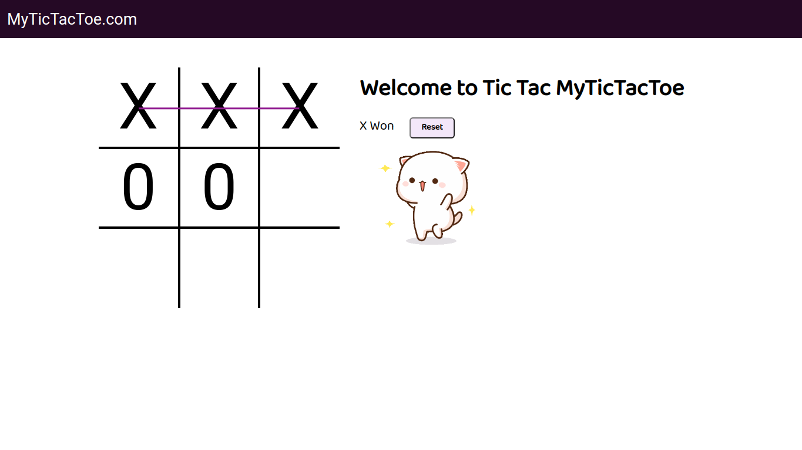

# TIC TAC TOE GAME
<h2>AUTHOR - HAFSA KHAN LODHI</h2>

<h3>Click Here To Visit : https://hafsalodhi2023.github.io/Tic_Tac_Toe_Game/</h3>





## Clone Repository ✌
### Step 1: Install Git (if not already installed)
Make sure you have Git installed on your machine. If not, download and install it from <a href="https://git-scm.com/" >Git's official website</a>.
### Step 2: Open Terminal or Command Prompt
Open your terminal or command prompt on your local machine.
### Step 3: Navigate to Your Desired Directory
Use the cd command to navigate to the directory where you want to clone the "Tic_Tac_Toe_Game" repository.
```bash
cd path/to/your/directory
```
### Step 4: Clone the Repository
Run the following command to clone the "Tic_Tac_Toe_Game" repository:
```bash
git clone https://github.com/hafsalodhi2023/Tic_Tac_Toe_Game.git
```
### Step 5: Navigate to the Cloned Directory
Move into the cloned "Tic_Tac_Toe_Game" directory using the cd command:
```bash
cd Tic_Tac_Toe_Game
```

## You have successfully cloned the repository! Feel free to explore the contents !! 👍
